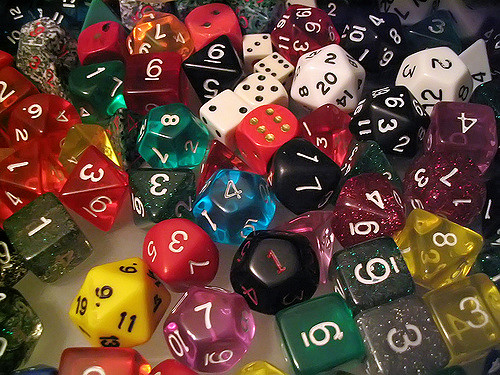
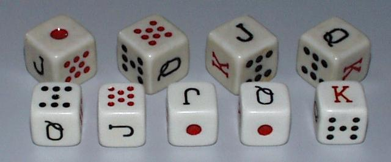

Rolling the Dice
================

   Image used under Creative Commons SA (https://www.flickr.com/photos/tomitapio/)

A die makes a nice example of a simple object that we can model with a Python class.  We have a couple of simple instance variables, such as the the possible values (number of sides) and the current value.  A Die object also has one simple method -- ``roll``.  This method will simply get a new current value for the die.

.. activecode:: die1
    :language: python

    import random

    random.seed(42)

    class MSDie:
        def __init__(self, num_sides):
            self.num_sides = num_sides
            self.roll()

        def roll(self):
            self.value = random.randrange(self.num_sides) + 1
            return self.value

    d = MSDie(6)
    e = MSDie(12)
    for i in range(5):
        d.roll()
        e.roll()
        print(d, e.value)

This simple example gives us a lot to explore:

* How come the dice prints weird
* How can I protect the value of the die?
* What if I want to have a dice with 10, Jack, Queen, King, Ace, Joker as the values?
* How come I always get the same sequence of numbers when I run the example above?
* How does this random stuff really work?  When I am programming where do these random numbers come from?

A different implementation
--------------------------

One common variant of dice is the game of poker played with dice where the faces of each die have either
Ace, King, Queen, Jack, Ten or Nine on them as shown in the picture below.

   http://averweij.web.cern.ch/averweij/sp-poker.htm

How would you change the definition of the MSDie class to allow for an arbitrary label to appear on each face of the die?

.. activecode:: die2
    :language: python

    import random

    random.seed(42)

    class MSDie:
        def __init__(self, values):
            self.possible_values = values
            self.roll()

        def roll(self):
            self.value = random.choice(self.possible_values)
            return self.value

    d = MSDie([1,2,3,4,5,6])
    e = MSDie(range(1,13))
    f = MSDie(['Nine','Ten','Jack','Queen','King','Ace'])
    for i in range(5):
        d.roll()
        e.roll()
        print(d, e.value)

In looking at the print statement you might notice that to print d, gives us a rather unhelpful representation of our dice.  We can fix this by writing a special method called ``__str__``  This method must return a string, and is used by the ``print`` function as well as the ``str`` function when you want to have a string representation of the object.  In our case it is easy we can add:

::

    def __str__(self):
        return str(self.value)

Now, lets suppose that we want to make our great MSDie class available to the public.  People from around the world will use our class to make games of chance.  There might be one small problem, that could ruin our reputation.  Consider the following:

::

    d = MSDie(range(1,7))
    d.roll()
    d.value = 6
    print(d)

Wait, that seems wrong!    What if some hacker got in and fixed our dice game so that they would always win by manually setting the value of the dice!  Our reputation would be ruined, and nobody would want to play games that used our dice.

Protecting the values of instance variables is a common practice provided by many object oriented languages, and Python is no exception.  Lets modify the program to protect the value of the die from being manipulated by hackers, in the same way that many programming languages do, and then we will look at a more Pythonic approach.

.. activecode:: die3
    :language: python

    import random

    random.seed(42)

    class MSDie:
        def __init__(self, values):
            self.possible_values = values
            self.roll()

        def roll(self):
            self.__value = random.choice(self.possible_values)
            return self.__value

        def get_value(self):
            return self.__value

    d = MSDie([1,2,3,4,5,6])
    print(d)
    print(d.get_value())
    print(d.__value)

Notice that the error we get at the end of this example!  We are told that the object has no attribute ``__value`` that is because in Python, instance variables that start with two underscores are not visible outside of the class definition.  This also prevents a hacker from writing a statement like ``d.__value = 6``

However, the cost of this protection is that we can no longer directly print the value of an instance variable, we must write a method to get the value for us.  The new method that we added to the class, ``get_value`` is one half of a pair of methods that are used by languages like Java and C++ called 'getters' and 'setters'  In those languages you do not access instance variables directly, like we have in our first couple of examples, but rather you access the instance variables through the use of getter and setter methods.   Getter and Setter methods are nice, but they add visual complexity to the code that makes it a bit harder to understand.   So, Python classes typically use 'properties' to preserve the visual cleanliness of the code while providing the security of getter and setter methods.

Try the following example in your Python IDE.

::

    import random

    random.seed(42)

    class MSDie:
        def __init__(self, values):
            self.possible_values = values
            self.roll()

        def roll(self):
            self.__value = random.choice(self.possible_values)
            return self.__value

        def get_value(self):
            return self.__value

        def set_value(self,newvalue):
            print("Bad!  You should not change the value of the dice")

        value = property(get_value, set_value)

    d = MSDie([1,2,3,4,5,6])
    print(d)
    print(d.value)
    print(d.get_value())
    d.value = 6

Now lets round out this section by making a little Dice Poker game.  For that we will want to add a Cup to keep track of our dice, roll them, and print out the values of all of the dice in the cup.

.. activecode:: cup1
    :language: python

    import random

    random.seed(42)

    class MSDie:
        def __init__(self, values):
            self.possible_values = values
            self.roll()

        def roll(self):
            self.__value = random.choice(self.possible_values)
            return self.__value

        def get_value(self):
            return self.__value

        def __str__(self):
            return str(self.__value)

    class Cup:
        def __init__(self,numDice,numSides=6):
            self.dieList = [MSDie(range(1,numSides+1)) for i in range(numDice)]

        def shake(self):
            for d in self.dieList:
                d.roll()

        def __str__(self):
            return str([str(d) for d in self.dieList])

    c = Cup(5,6)
    for i in range(3):
        c.shake()
        print(c)

At this point things are looking pretty good.  However, in a game of poker or yahtzee or whatever you usually only roll all of the dice on the first roll of your turn.  After the turn you probably want to select a few dice to keep as they are and you want to roll some of them again.  There are several different approaches to the idea of rolling only some of the dice.

1.  Add methods to the Cup so that a die can be removed from the cup.  You will also want to add dice back to the cup later so you would need a method for that too.
2.  Add a method to the Cup so that you can mark some dice to be "unrollable" that is the dice stay in the cup, but shake doesn't roll them.
3.  Add a method to the die to make a die 'frozen' so that when the roll method is called on the die, the value does not change if the die is frozen.
4.  Add a roll method to the Cup class that accepts a list (or a variable number of parameters!!) and only rolls the dice dice you have specified.

All of these methods have good educational value.  The easiest may be number 4.

.. activecode:: cup1
    :language: python

    import random

    random.seed(42)

    class MSDie:
        def __init__(self, values):
            self.possible_values = values
            self.roll()

        def roll(self):
            self.__value = random.choice(self.possible_values)
            return self.__value

        def get_value(self):
            return self.__value

        def __str__(self):
            return str(self.__value)

    class Cup:
        def __init__(self,numDice,numSides=6):
            self.dieList = [MSDie(range(1,numSides+1)) for i in range(numDice)]

        def shake(self):
            for d in self.dieList:
                d.roll()

        def roll(self,*args):
            for i in args:
                if i > 0 and i <= len(args):
                    self.dieList[i-1].roll()

        def __str__(self):
            return str([str(d) for d in self.dieList])

    c = Cup(5,6)
    for i in range(3):
        c.shake()
        print(c)

* If I want to make a dice game it might be nice to be able to compare two dice objects without having to get their value.
